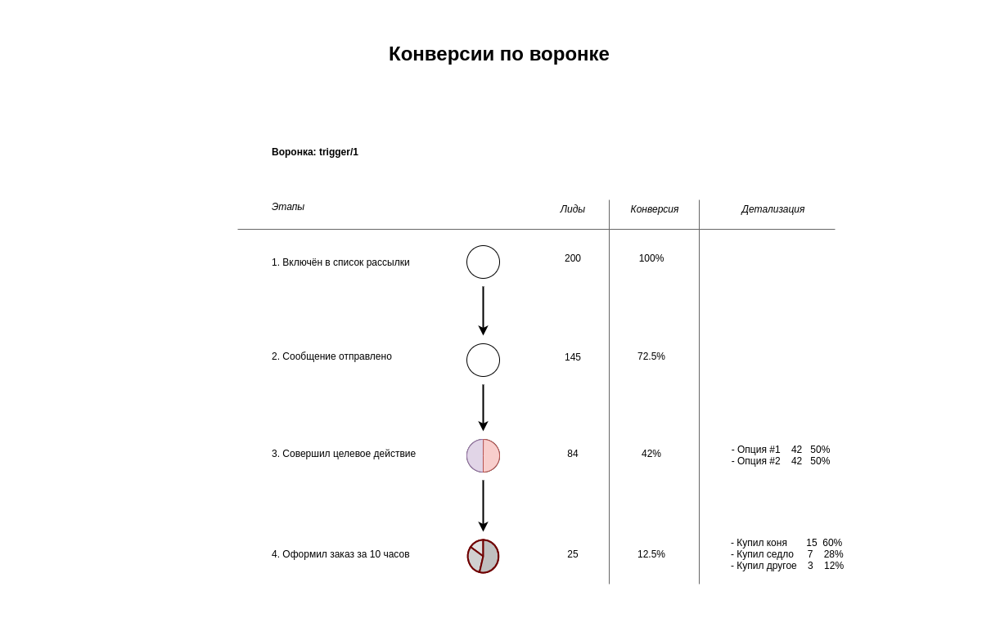

# Funnels — Воронки

Модуль «Funnels» помогает реализовать в вашем Django-приложении функционал маркетинговых воронок.

С помощью модуля «Funnels» вы сможете считать конверсии как в простых случаях, так и в самых затейливых:

- по рассылкам триггерным и разовым
- по целевым действиям внутри чат-бота
- по когортам: дата регистрации или рассылки, вариант A/B теста
- по многим параллельно работающим независимым воронкам
- по сложным разветвлённым воронкам
- с подсчётом переходов по ссылкам [в разработке]

Из коробки модуль «Funnels» поможет вам:

- Сохранить в БД важную для маркетинга информацию: когда пользователь отреагировал на сообщение, что он выбрал, сумма чека.
- Использовать в одном django-приложении сразу несколько разных типов воронок c отличающимися этапами и событиями
- Покрыть воронку автотестами, быстро и легко
- Предоставить маркетологу готовую админку для анализа конверсий [в разработке]
- Для маркетога сохранить в БД подробную историю событий [в разработке]
- Через админку загрузить/выгрузить пользователей для рассылки [в разработке]

Модуль «Funnels» позволяет легко интегрировать воронки с другими модулями Django Tg Bot Framework:

- с диалоговой стейт-машиной `private_chats`
- со стейт-машиной групповых чатов
- с редактируемыми текстовками `editable_messages`
- ...

## Как устроен модуль «Funnels»

Под капотом модуль «Funnels» использует стейт-машину на базе Yostate.

Ключевые концепции модуля «Funnels» описаны в файле [concepts.yaml](concepts.yaml).

Примеры использования можно найти в django-проекте Starter Pack и/или в автотестах модуля «Funnels» в каталоге [tests](tests).
